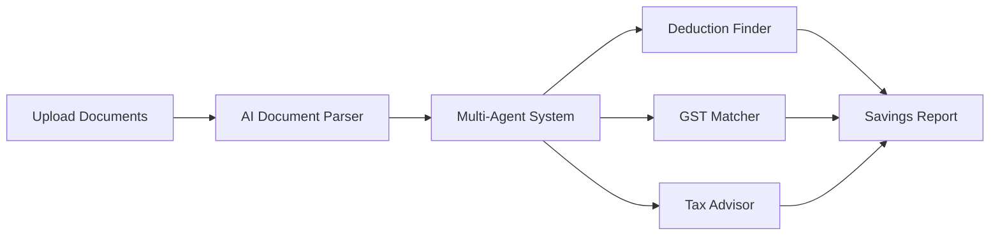

# TaxNova - AI Tax Intelligence for India 🇮🇳


> **Stop losing money to missed deductions. Let AI find your tax savings.**

[](https://nextjs.org/)
[](https://fastapi.tiangolo.com/)
[](https://www.python.org/)

---

## 💸 The Problem

**Salaried Individuals** lose **₹15K-₹50K annually** due to:
- Wrong tax regime selection (Old vs New)
- Missed HRA, 80C, 80D exemptions
- ₹5K-₹15K CA fees for basic filing

**SMEs** lose **₹50K-₹3L annually** due to:
- Missed tax deductions across 70+ Income Tax sections
- Unclaimed GST Input Tax Credit (15-25% leakage)
- 40+ hours/month on manual reconciliation

**Real Example**: A ₹15 LPA engineer paid ₹22K extra tax by choosing the wrong regime.

---

## ✨ The Solution: TaxNova

**TaxNova is your AI-powered virtual CA** that analyzes your financial documents in seconds to:
1. **Find missed tax deductions** (Section 80C, 80D, 35, 80JJAA, etc.)
2. **Reconcile GST ITC** (GSTR-2B ↔ Purchase Register matching)
3. **Optimize tax regime** (Old vs New comparison)
4. **Answer tax questions** in natural language

### How It Works



**For Individuals**: Upload salary slip → Get HRA/80C/80D optimization + regime comparison  
**For SMEs**: Upload expenses → Get missed deductions + GST ITC reconciliation

---

## 🚀 Key Features

### 1. 🔍 AI Deduction Finder
**Problem**: Manual review of expenses misses 30-40% of eligible deductions  
**Solution**: AI scans documents against 70+ tax rules  
**Output**: "Found ₹1.2L in missed deductions → Save ₹37K in taxes"

**Example**:
```
✅ R&D Deduction (Section 35)
Amount: ₹85,000 | Tax Saved: ₹39,525
Evidence: Invoice SW-Dev-234
Reason: Software development qualifies for 150% weighted deduction
```

---

### 2. 🧾 GST ITC Auto-Matcher
**Problem**: Manual GSTR-2B reconciliation takes 8-15 hours/month  
**Solution**: AI fuzzy-matches invoices in 45 seconds  
**Output**: Missing ITC alerts with vendor action items

**Before TaxNova**: 8 hours, 18% error rate  
**With TaxNova**: 45 seconds, 97% accuracy

**Example**:
```
⚠️ Missing ITC: ₹8,100
Invoice: PUR/24/1847 | Vendor: ABC Industries
Reason: Vendor filed GSTR-1 late
Action: Claim in next month's GSTR-3B
```

---

### 3. 💬 Context-Aware Tax Chat
**Problem**: Generic chatbots don't understand YOUR finances  
**Solution**: AI remembers conversation + links to YOUR documents

**Ask naturally**:
- "How much tax will I save?"
- "Why didn't I get my LIC deduction?"
- "Which vendors haven't filed GST?"

**Example Conversation**:
```
You: Find deductions in my expenses
AI: Found 4 deductions totaling ₹2.1L → Save ₹71K in taxes

You: Tell me about the first one
AI: R&D expenses (₹85K) qualify for 150% deduction under Section 35
    Evidence: Invoice SW-Dev-234 | Tax Saved: ₹39,525
```

---

### 4. ⚖️ Old vs New Regime Comparator (Individuals)
**Problem**: 60% choose the wrong regime  
**Solution**: AI calculates both, recommends better option

**Example**:
| Regime | Taxable Income | Tax | Verdict |
|--------|---------------|-----|---------|
| Old | ₹11.6L | ₹56K | ✅ Save ₹22K |
| New | ₹14.5L | ₹78K | ❌ |

---

### 5. 🏠 HRA Optimizer (Individuals)
**Problem**: Complex 3-rule calculation confuses taxpayers  
**Solution**: AI auto-calculates max exemption from salary slip

**Output**:
```
Your HRA Exemption: ₹1,65,000 (chosen from 3 rules)
💡 Tip: Increase rent to ₹2.85L to maximize exemption
```

---

## 🤖 Technology: Multi-Agent AI System

**Not a generic chatbot** - TaxNova uses specialized AI agents:

1. **Orchestrator Agent**: Routes queries to right specialist
2. **Document Extractor**: Parses PDFs, Excel, scanned receipts
3. **Deduction Finder**: Applies 70+ tax rules from Income Tax Act
4. **GST Matcher**: Fuzzy-matches invoices across formats
5. **Tax Advisor**: Answers questions based on YOUR data

**Powered by**: GPT-4, Claude, Gemini (via OpenRouter)

---

## 📊 Impact

### For Individuals
- Save ₹15K-₹50K annually
- Choose correct tax regime
- File ITR confidently

### For SMEs
- Recover ₹50K-₹3L in missed deductions
- Claim 15-25% more GST ITC
- Reduce compliance time: 40 hrs → 4 hrs/month

### For CAs
- 10x productivity (handle 10x more clients)
- Offer AI-powered insights
- Focus on advisory vs manual work

---

## 🎯 Use Cases

1. **Year-End Tax Planning**: Upload expenses in March → AI finds ₹2.5L deductions → Still time to invest  
2. **Monthly GST Reconciliation**: Upload GSTR-2B on 15th → AI reconciles in 2 min → Follow up vendors before 20th  
3. **Regime Selection**: Upload salary slip → AI compares Old vs New → Share report with HR  
4. **Vendor Compliance**: "Which vendors haven't filed GST?" → AI lists 12 pending vendors → Auto-email follow-ups

---

## 🛠️ Tech Stack

**Frontend**: Next.js 15, TypeScript, Tailwind, shadcn/ui  
**Backend**: FastAPI (Python), Pydantic, PyPDF2  
**AI**: OpenRouter (GPT-4, Claude, Gemini), Custom multi-agent orchestration  
**Deploy**: Vercel (frontend), Railway (backend)

---

## 🚀 Quick Start

```bash
# Clone repo
git clone https://github.com/sushantpatil03/MumbaiHacks.git
cd mumbai-hacks-final

# Backend
cd backend_sme
python -m venv venv && source venv/bin/activate
pip install -r requirements.txt
echo "OPENROUTER_API_KEY=your_key" > .env
python main.py  # Runs on :8000

# Frontend
cd ../frontend
npm install && npm run dev  # Runs on :3000
```

Open `http://localhost:3000` → Choose "SME" or "Salaried" → Upload documents

---

## 📈 Roadmap

**Next 3 Months**:
- TDS reconciliation (Form 26AS)
- Automated ITR filing
- WhatsApp bot for receipts

**Vision**: Become the **Copilot for Indian Tax Compliance**

---

## 👥 Team

Built with ❤️ for Mumbai Hacks 2025

Pitch Deck: https://docs.google.com/presentation/d/1-TXkOWY8HLbPmGxT-RbKE0F8ix4YejQI-WcCLdYl-yc/edit?usp=sharing

---

**TaxNova - Every rupee saved is a rupee earned. 🚀💰**
